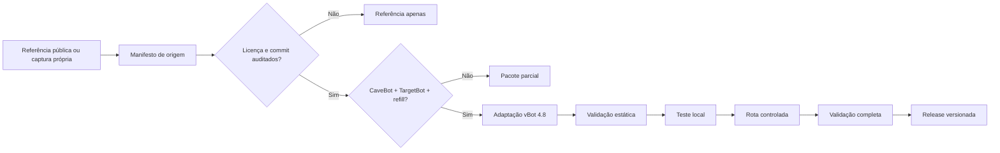

<div align="center">
  

  # MarolaOT Scripts

  **Automação reproduzível, diagnóstico e manutenção segura para MarolaOT, OTClient e vBot 4.8.**

  [](https://github.com/Samurai33/MarolaOT-Scripts/actions/workflows/powershell-lint.yml)
  [](https://github.com/Samurai33/MarolaOT-Scripts/actions/workflows/validate-json.yml)
  [](LICENSE)
  [](https://github.com/OTCv8/otclientv8)
  [](scripts/windows/vbot)
  [](#compatibilidade)
  [](SECURITY.md)

  [Documentação](docs/) · [Catálogo](docs/CATALOG.md) · [Prioridades](docs/PRIORITY_BLOCKS.md) · [Fontes](docs/research/SOURCE_REGISTRY.md) · [Segurança](SECURITY.md) · [Contribuição](CONTRIBUTING.md)
</div>

---

## Sobre o projeto

O **MarolaOT-Scripts** centraliza automações para o ecossistema MarolaOT com quatro objetivos:

- instalar configurações de forma reproduzível;
- validar arquivos antes de abrir ou operar o cliente;
- criar backup antes de qualquer alteração;
- permitir rollback sem depender de memória ou intervenção improvisada.

O projeto segue uma política de **evidência antes de implementação**. Nenhuma hunt ou quest é considerada em desenvolvimento apenas por possuir uma pasta ou uma ideia. Para avançar, o pacote precisa registrar fonte, commit, licença, componentes disponíveis e lacunas conhecidas.

> [!IMPORTANT]
> Scripts de configuração terminam com CaveBot, TargetBot, AttackBot e HealBot desligados. A ativação ocorre manualmente e por etapas.

## Estado atual

| Maturidade | Pacote | Estado | Próxima ação |
|---:|---|---|---|
| **M6** | Cobra Tower — MS 550+ | Rota, refill, TargetBot e combate adaptados e funcionais | Consolidar como release M7 |
| **M1/M2 parcial** | Werehyaenas — MS 300+ | TargetBot comunitário localizado; rota e refill não confirmados | Auditar licença e localizar CaveBot completo |
| **M0/M1** | Summer Court — MS 500+ | Pesquisa; nenhum pacote completo confirmado | Continuar busca sem inventar rota |
| **M0** | Outras hunts e quests | Backlog orientado por evidência | Selecionar pela qualidade das fontes |

A matriz completa está em [`docs/CATALOG.md`](docs/CATALOG.md).

## O que está incluído

### Automação do vBot 4.8

- criação e ajuste de AttackBot, HealBot e Supplies;
- seleção segura de CaveBot e TargetBot;
- backup versionado antes da gravação;
- normalização de JSON em UTF-8 sem BOM;
- validações pós-escrita;
- checksums SHA-256;
- restauração de arquivos isolados.

### Diagnóstico do cliente

- teste de inicialização com configurações isoladas;
- consulta a eventos do Windows;
- detecção de executável e processos presos;
- quarentena reversível de configurações;
- validação de schema e sintaxe JSON.

### Governança de pacotes

- manifesto obrigatório de origem;
- registro de repositório, commit, arquivos e licença;
- níveis de maturidade M0–M7;
- critérios de entrada e saída por prioridade;
- separação entre referência, adaptação, teste e release.

## O que o projeto não faz

- não inventa waypoints ou diálogos de NPC;
- não transforma TargetBot isolado em “hunt completa”;
- não republica código de terceiros sem avaliar licença;
- não armazena credenciais, tokens, IPs privados ou dumps reais;
- não automatiza escolhas irreversíveis de quests sem checkpoint manual;
- não ativa bots automaticamente após a instalação.

## Pipeline de portabilidade



## Modelo de maturidade

| Nível | Nome | Critério resumido |
|---:|---|---|
| M0 | Ideia | Sem fonte técnica suficiente |
| M1 | Referência encontrada | Fonte localizada |
| M2 | Referência auditada | Commit, arquivos, licença e dependências registrados |
| M3 | Adaptado | Conteúdo convertido para MarolaOT/vBot 4.8 |
| M4 | Teste local | JSONs e combate validados fora da rota |
| M5 | Rota controlada | Entrada, refill, loop e retorno testados |
| M6 | Validado | Volta completa, backup e rollback confirmados |
| M7 | Release | Pacote versionado, checksums e notas publicados |

Detalhes e critérios: [`docs/PRIORITY_BLOCKS.md`](docs/PRIORITY_BLOCKS.md).

## Pacote de referência: Cobra Tower MAX DPS v2

A Cobra Tower é o pacote operacional mais maduro do projeto. A adaptação inclui:

- Rage of the Skies com trava local alinhada ao cooldown;
- Energy Wave e Great Fire Wave como preenchimento de rotação;
- GFB para grupos;
- Ultimate Energy Strike e SD para alvo isolado;
- supplies de UMP, GFB e SD;
- TargetBot dedicado às Cobras;
- looting interno desligado para uso do lootbag do servidor;
- refill integrado à rota;
- instalador com backup e validação.

### Rotação ofensiva

| Prioridade | Condição | Ação | Trava local |
|---:|---|---|---:|
| 1 | 6+ Cobras, HP ≥ 35% | Rage of the Skies | 40,5 s |
| 2 | 3+ alinhadas | Energy Wave | 8,25 s |
| 3 | 3+ alinhadas | Great Fire Wave | 4,25 s |
| 4 | 2+ no melhor tile | Great Fireball Rune | 2 s |
| 5 | Alvo isolado, HP ≥ 30% | Ultimate Energy Strike | 30,5 s |
| 6 | Alvo restante | Sudden Death Rune | 2 s |

## Scripts disponíveis

| Script | Finalidade |
|---|---|
| [`Set-CobraTowerMaxDpsV2.ps1`](scripts/windows/vbot/Set-CobraTowerMaxDpsV2.ps1) | Instala e normaliza o perfil Cobra Tower MAX DPS v2 |
| [`Test-MarolaOTClientMatrix.ps1`](scripts/windows/vbot/Test-MarolaOTClientMatrix.ps1) | Testa inicialização do cliente com configurações isoladas |
| [`Restore-VBotCoreConfigs.ps1`](scripts/windows/vbot/Restore-VBotCoreConfigs.ps1) | Restaura AttackBot, HealBot e Supplies da quarentena |
| [`Test-VBotJson.ps1`](scripts/windows/vbot/Test-VBotJson.ps1) | Valida JSON, schema básico e estado dos módulos |

## Uso rápido

### Requisitos

- Windows;
- PowerShell 5.1 ou superior;
- MarolaOT Client com vBot 4.8;
- cliente completamente fechado durante alterações;
- cópia local deste repositório.

### Clonar

```powershell
git clone https://github.com/Samurai33/MarolaOT-Scripts.git
cd MarolaOT-Scripts
```

### Validar antes de alterar

```powershell
Set-ExecutionPolicy -Scope Process Bypass -Force
.\scripts\windows\vbot\Test-VBotJson.ps1
```

### Instalar Cobra Tower MAX DPS v2

```powershell
.\scripts\windows\vbot\Set-CobraTowerMaxDpsV2.ps1
```

O caminho padrão é:

```text
C:\Users\Samurai\AppData\Roaming\marolaot\marolaot\marolaot\bot\vBot_4.8
```

Outro perfil pode ser informado explicitamente:

```powershell
.\scripts\windows\vbot\Set-CobraTowerMaxDpsV2.ps1 `
  -ProfilePath "C:\caminho\para\vBot_4.8"
```

## Teste local seguro

O teste de combate deve ocorrer fora de protection zone, com CaveBot desligado.

```text
/i 3191,300
/i 3155,300
/i 23373,200
/m Cobra Assassin,3,,2
```

Sequência recomendada:

1. iniciar com todos os módulos desligados;
2. ativar AttackBot e conferir o perfil selecionado;
3. ativar TargetBot somente durante o teste controlado;
4. verificar runas, waves, cooldowns e cura;
5. desligar os módulos;
6. testar CaveBot apenas em uma etapa posterior.

## Estrutura do repositório

```text
MarolaOT-Scripts/
├── .github/
│   ├── ISSUE_TEMPLATE/
│   ├── PULL_REQUEST_TEMPLATE.md
│   └── workflows/
├── assets/
├── configs/vbot-4.8/examples/
├── docs/
│   ├── research/
│   ├── CATALOG.md
│   └── PRIORITY_BLOCKS.md
├── hunts/
├── quests/
├── schemas/
├── scripts/
│   ├── server/
│   └── windows/vbot/
├── templates/
├── CHANGELOG.md
├── CONTRIBUTING.md
├── LICENSE
├── SECURITY.md
└── README.md
```

## Manifesto de origem

Todo novo pacote deve possuir um `source-manifest.json` compatível com:

- [`schemas/source-manifest.schema.json`](schemas/source-manifest.schema.json)
- [`templates/source-manifest.example.json`](templates/source-manifest.example.json)

O manifesto registra:

- nome, tipo, vocação e faixa do pacote;
- versão alvo do cliente e do bot;
- repositórios, commits e caminhos de origem;
- licença e permissão de redistribuição;
- componentes presentes e ausentes;
- mudanças feitas na adaptação;
- evidências de teste;
- requisitos de backup, rollback e módulos desligados.

## Blocos de prioridade

### P0 — Fundação e governança

Manifesto, registro de fontes, maturidade, templates e validação no CI.

### P1 — Cobra Tower como release de referência

Reorganizar a automação funcional em um pacote autocontido e publicar `cobra-tower-v1.0.0`.

### P2 — Werehyaenas orientada por evidência

Auditar licença, localizar CaveBot/refill e adaptar apenas componentes confirmados.

### P3 — CI e schemas avançados

Validar manifestos, AttackBot, HealBot, Supplies, TargetBot e sintaxe conhecida do CaveBot.

### P4 — Framework seguro de quests

Checklists, storages, validação sem alteração e checkpoints manuais para ações irreversíveis.

### P5 — Expansão do catálogo

Selecionar novas hunts pela completude e qualidade das referências, não apenas por popularidade.

A execução detalhada está em [`docs/PRIORITY_BLOCKS.md`](docs/PRIORITY_BLOCKS.md).

## Fontes e proveniência

O projeto utiliza três classes de referência:

1. **Upstream técnico:** [`OTCv8/otclientv8`](https://github.com/OTCv8/otclientv8), usado como base estrutural do vBot 4.8.
2. **Conteúdo comunitário:** [`Kolczan/Tibia-Scripts`](https://github.com/Kolczan/Tibia-Scripts), usado como referência de hunts e configurações.
3. **Documentação comunitária:** threads do OTLand para sintaxe, waypoints, labels, callbacks e padrões operacionais.

O inventário auditável está em [`docs/research/SOURCE_REGISTRY.md`](docs/research/SOURCE_REGISTRY.md).

> [!WARNING]
> A licença MIT deste repositório cobre o conteúdo original do MarolaOT-Scripts. Código, rotas e dados provenientes de terceiros permanecem sujeitos às licenças e termos de suas respectivas fontes.

## Segurança operacional

- feche o cliente antes de executar scripts de alteração;
- revise a saída antes de abrir o MarolaOT;
- não pule o backup automático;
- mantenha os módulos desligados após instalação;
- não publique credenciais ou dados internos;
- valide localmente antes de executar uma rota;
- pare quests antes de bosses, escolhas ou consumo de itens raros;
- preserve os diretórios de backup até concluir o rollback testado.

Consulte [`SECURITY.md`](SECURITY.md) para reportar problemas de forma responsável.

## Contribuição

Contribuições são bem-vindas quando preservam rastreabilidade e segurança.

Antes de abrir um pull request:

- adicione ou atualize o manifesto de origem;
- indique fonte, commit e licença;
- descreva alterações e riscos;
- inclua procedimento de rollback;
- remova dados sensíveis;
- execute os validadores disponíveis;
- não marque como validado algo que ainda não completou uma volta real.

Leia [`CONTRIBUTING.md`](CONTRIBUTING.md).

## Compatibilidade

| Componente | Alvo atual |
|---|---|
| Sistema operacional | Windows |
| Shell | Windows PowerShell 5.1+ / PowerShell 7+ |
| Cliente | MarolaOT Client |
| Bot | vBot 4.8 |
| Vocação de referência | Master Sorcerer |
| Servidor de referência | MarolaOT |

Compatibilidade com outros clientes ou servidores não é presumida. IDs, spells, NPCs, storages, coordenadas e cooldowns podem variar.

## Aviso legal

Este é um projeto independente para administração e automação do ambiente MarolaOT. Não possui afiliação oficial com CipSoft, Tibia, OTCv8 ou autores de repositórios comunitários citados. Marcas e conteúdos de terceiros pertencem aos respectivos proprietários.

O uso de automações deve respeitar as regras do servidor em que forem executadas.

## Licença

O conteúdo original deste repositório é distribuído sob a licença [MIT](LICENSE).

Materiais externos mantêm suas próprias licenças e devem ser tratados conforme o [Registro de Fontes](docs/research/SOURCE_REGISTRY.md).

---

<div align="center">
  <strong>MarolaOT Scripts</strong><br>
  Evidência antes da automação. Backup antes da mudança. Rollback antes da confiança.
</div>
