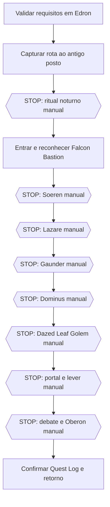

# The Order of the Falcon — quest assistida

> **Maturidade:** M2 — fontes auditadas, rota ainda não capturada e pacote não instalável.

Esta é a primeira quest do bloco **P4 — framework seguro para quests e acessos** do MarolaOT-Scripts.

A escolha de The Order of the Falcon foi baseada em quatro fatores:

- sequência relativamente curta;
- utilidade prática por liberar Falcon Bastion;
- progressão técnica verificável no Canary;
- possibilidade de dividir navegação e ações críticas em checkpoints claros.

## Estado atual

| Componente | Estado |
|---|---|
| TibiaWiki | referência editorial auditada |
| Canary | storages, doors, boats, bosses e Oberon auditados |
| Rota pronta pública | não localizada |
| Rota própria | planejada, ainda não capturada |
| Ritual | manual obrigatório |
| Minibosses | manuais obrigatórios |
| Oberon | totalmente manual |
| Instalador | inexistente e proibido em M2 |
| Teste no personagem | não realizado |

## Arquivos

```text
quests/access/the-order-of-the-falcon/
├── README.md
├── checklist.md
├── source-manifest.json
├── source-lock.json
├── evidence/
│   └── quest-data.json
├── route/
│   └── README.md
└── validation/
    └── test_order_of_the_falcon_research.py
```

## Fontes

### TibiaWiki Brasil

Usada para:

- requisitos;
- sequência operacional;
- referência de início em Edron;
- preparação do Bucket Filled with Chalk;
- condição noturna do ritual;
- ordem editorial das áreas e bosses.

O texto, mapas e imagens da wiki não são copiados para este repositório. Somente fatos e estrutura são parafraseados.

### OpenTibiaBR Canary

Commit auditado:

```text
a879c9312e34381e8eedf397b8ed44510698b689
```

Usado para confirmar:

- mission id `10464`;
- storages simbólicos `Questline` e `KillingBosses`;
- sequência dos cinco bosses intermediários;
- gates de portas e barcos;
- exigência `KillingBosses >= 5` antes do Oberon;
- limite de cinco jogadores;
- cooldown de 20 horas;
- conclusão da quest após Grand Master Oberon.

## Modelo de execução assistida



A automação futura poderá cuidar apenas de deslocamentos confirmados entre os blocos.

## Progressão auditada

| Valor | Encontro concluído | Efeito esperado |
|---:|---|---|
| 1 | Grand Commander Soeren | primeiro gate |
| 2 | Preceptor Lazare | novos gates internos |
| 3 | Grand Chaplain Gaunder | barcos liberados |
| 4 | Grand Canon Dominus | gates superiores |
| 5 | Dazed Leaf Golem | entrada do Oberon |
| 6 | Grand Master Oberon | conclusão principal |

Esses valores vieram do Canary e ainda devem ser comparados com o comportamento do MarolaOT.

## O que pode ser automatizado futuramente

- validação não invasiva de arquivos e requisitos conhecidos;
- deslocamento Edron → checkpoint do ritual;
- deslocamento entre áreas já capturadas;
- parada automática antes de itens, doors, boats e bosses;
- retorno seguro depois de uma etapa manual.

## O que continuará manual

- criação e uso do Bucket Filled with Chalk;
- confirmação do período noturno;
- qualquer item consumível de quest;
- os cinco bosses intermediários;
- barcos e portas na primeira validação;
- portal e alavanca do Oberon;
- debate e combate contra Oberon.

## Próxima etapa operacional

A promoção para M3 exige uma captura controlada no MarolaOT:

1. confirmar IDs do Bucket, Chalk e item resultante;
2. validar Quest Log e pré-requisitos;
3. capturar Edron → antigo posto sem executar o ritual;
4. validar o ritual manualmente;
5. capturar o interior em segmentos entre bosses;
6. registrar rota de retorno e recuperação;
7. validar labels e actions com o parser CaveBot do P3.

## Segurança

- nenhum waypoint foi criado a partir de screenshot;
- nenhuma ação irreversível é automática;
- nenhuma frase de diálogo/boss foi armazenada;
- nenhuma configuração local foi alterada;
- nenhum teste no personagem ocorreu nesta fase;
- o pacote permanece documental até a validação real do MarolaOT.

Acompanhamento: issue #9.
